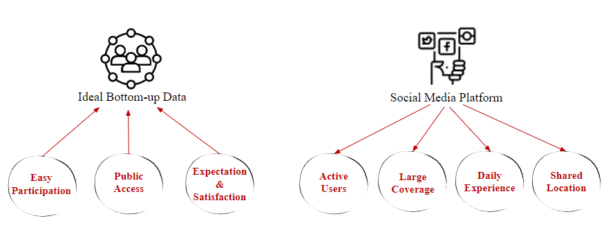
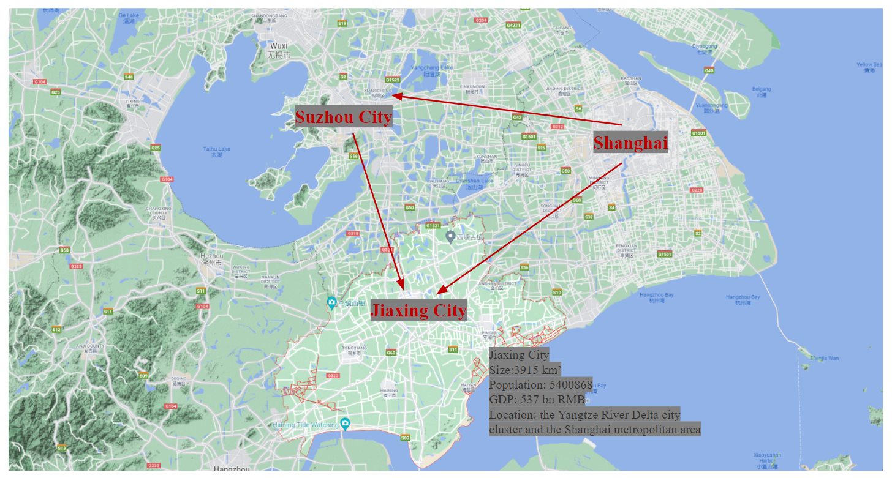
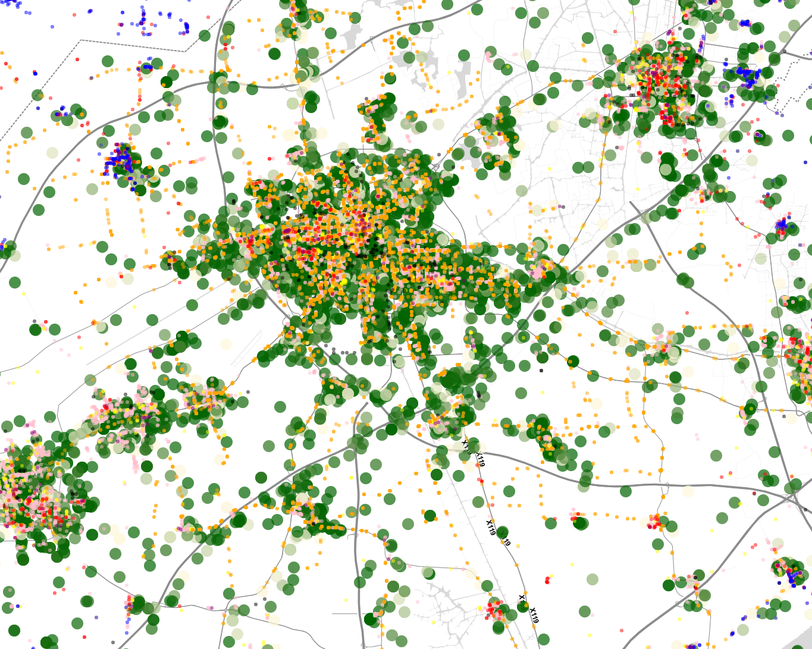
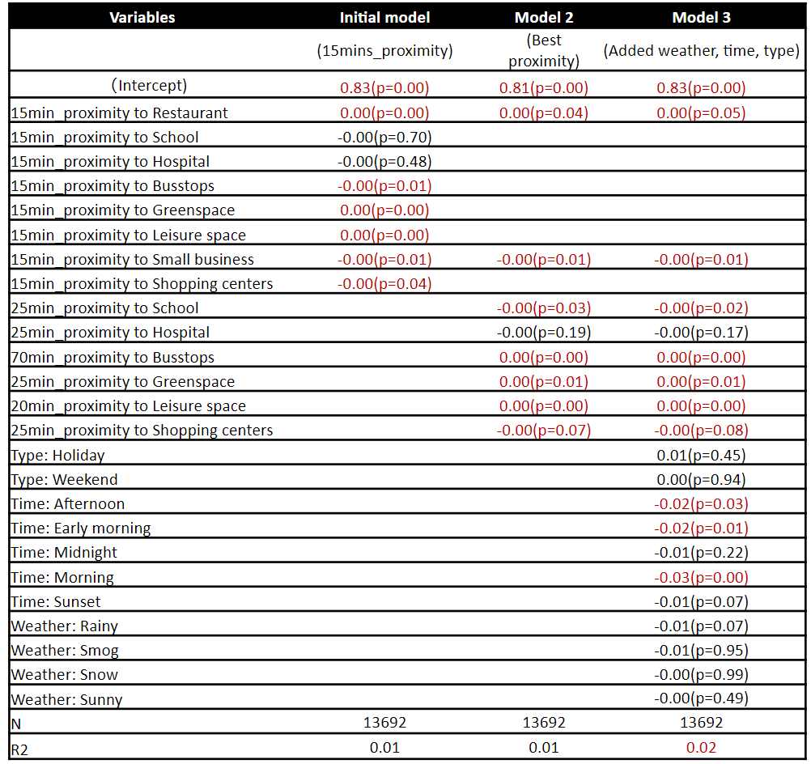
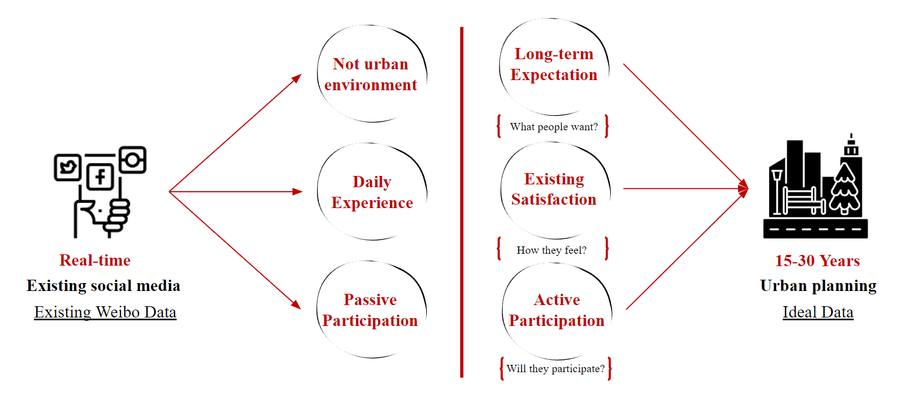
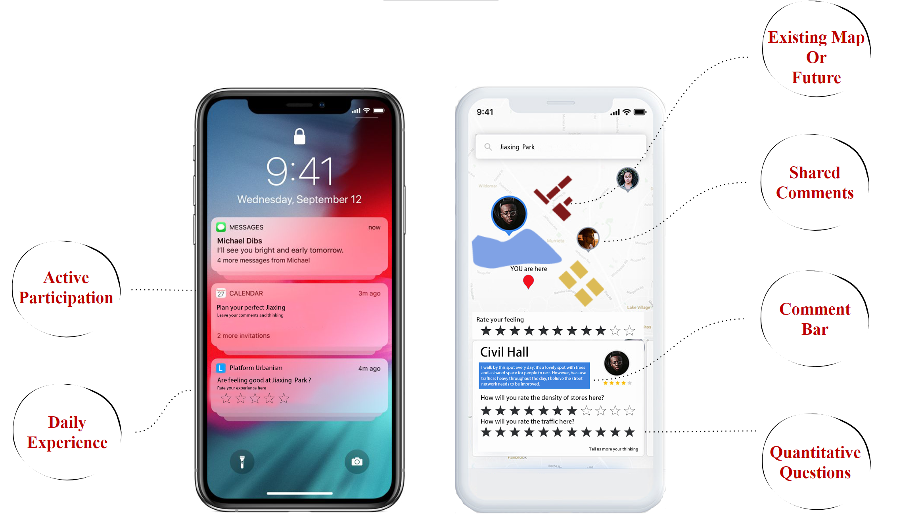
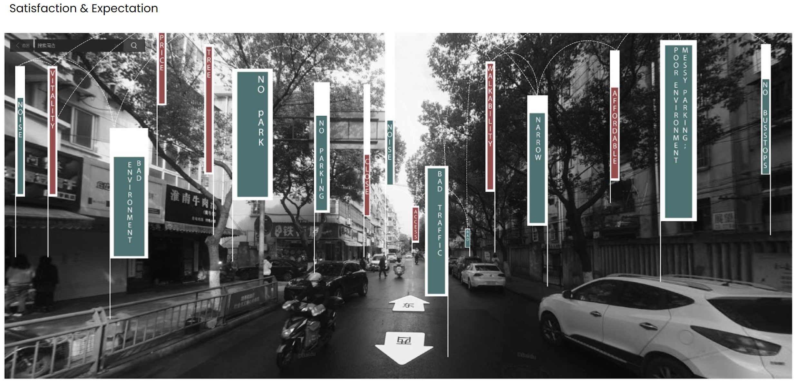

--A critical approach to measure the quality of urban experience from a social media platform
<br/>
<br/>
Yuanzhao WANG
<br/>
THESIS RESEARCH
<br/>
MDES ULE 2022
<br/>
Supervisor: Prof. Carole Voulgaris
<br/>
<br/>
```{r setup, include=FALSE}
knitr::opts_chunk$set(echo = TRUE)
```

# Abstract

This paper aims to examine the strengths and weaknesses of social media platforms and proposes a vision for a better platform to invite bottom-up citizen participation in data-driven urban planning for urban satisfaction. The research proposes a method to measure the emotional response of individual citizens to the characteristics of the built environment focusing on proximity and convenience between pedestrians and nearby commercial and cultural activities. The goal is to explore the relationships between citizens' sentiments, urban form, and urban activities, and build a regression model for optimizing urban satisfaction. By examining the existing Weibo data, the initial research revealed serious limitations that existing social media data that would merely provide sufficient information for quantitative urban planning. Finally, it proposes a better platform that can fulfill the need for more accurate data for quantifying individual urban satisfaction.


# Introduction
In China, the early stage of urbanization was subject to the national ambition and development, whose aim at boosting the economic production and consumption. As such, hundreds and thousands of cities and towns were built to serve for this purpose that plays an important role in improving the national economy based on the scarification of natural resource and incline of factory production (Zhang et al., 2020). However, since the decreasing demand for industrial production and the arise of urban awareness of residents happiness, the government has issued the "New Urbanization (citization and townization) Policy" and "Specialty Townization Policy" since 2014, increasingly focus on citizen wellbeing, urban governance and the urban environment (State Council of China, 2014). 

The new urban policies in China shifted the emphasis of urbanization away from economic development and toward human-centric development, improving residents' wellbeing and building new ecological smart cities. However, the evaluation of residents' wellbeing and urban planning process remains top-down and entirely conducted by governments and experts (figure 1). The qualitative surveys and reports could only cover a small proportion of population, and it becomes even harder and time-consuming as the population in cities and towns reached 848 millions (State Council of China, 2010). 

[](https://WTHSYZW.github.io/Thesis_2022/maps/topdown.pdf)  
figure 1 Top-down urban planning in China
  

With the introduction of social media data and machine learning technologies, new bottom-up data and methods for studying urban spatial patterns and residents' life have emerged. The ideal bottom-up data for planner should have three characteristics. First, easy Participation: People should be easy to participate, which means people don’t need to leave a period of time and show up in a specific place to engage. Second, public Access: most people should be able to access. Lastly, people should be able to express their long-tome expectations of the city and their satisfaction regarding the existing conditions. 

In 2022, there were more than 1.02 billion people have access to mobile internet, while 68% of them frequently use social media platform (DataReportal, 2022). The large population coverage and easy participation of social media data can meet some of the needs of ideal data, but not all of them. Existing data can only generate real-time daily experiences that are not specific to the built environment or long-term well-being (figure 2). 

[](https://WTHSYZW.github.io/Thesis_2022/maps/comparison.png){target="_blank"}
figure 2 comparison between ideal data and existing social media data  
  

To address the shortcomings of existing data and break the traditional top-down approach to urban planning, a thorough validation and a quantitative framework is required. I propose a research framework measuring the emotional response of individual citizens to the characteristics of the built environment focusing on proximity and convenience between pedestrians and nearby commercial and cultural activities. The goal is to explore the relationships between citizens' satisfaction, urban form, and urban activities. This approach can be applied to bring public satisfaction into the urban planning process through the social platform as a way to quantify the quality of urban life (figure 2). However, the simulation model based on the existing Weibo data revealed serious limitations. The discussion of the strengths and drawbacks of existing social media data leads to a vision for a better platform to invite bottom-up citizen participation in data-driven urban planning for urban satisfaction.


<!-- The AI-based technology such as sentiment analysis could be used to extract individual feelings from text-based information, as a form of public perception of urban space, contributing to bottom-up engagement and people-oriented urban planning. -->

<!-- To address the traditional top-down approaches to urban research, both government and academia pay more attention on emerging technologies and smart city concepts. However, prior to blindly applying urban big data, a thorough validation is required even it seems to be promising.  -->


[](https://WTHSYZW.github.io/Thesis_2022/maps/proposaldiagram.png){target="_blank"}
figure 3 Proposal diagram


# Literature Review

## Wellbeing as a Measure of Health and the Built environment

Scientists have historically measured well-being using objective indicators (e.g., GDP, health, employment, literacy, poverty) and increasing measured subjective well-being that influences individual life. Modern measures of well-being that account for cognitive evaluations (i.e., evaluative well-being) and reactions to experiences (i.e., experienced well-being) have therefore become the “currency of a life that matters” (Rath et al., 2010). As the concept of well-being develops, the indices including physical health, mental health, air quality and more are increasingly used, implying a strong relationship between health and residents’ well-being (Diener et al., 1999; Lawless & Lucas, 2010). Mouratidis (2018) further investigated different aspects of subjective well-being (SWB): hedonic, life satisfaction, and eudaimonic. He categorized neighborhood characteristics into objective and perceived, and proposed a conceptual framework to explain how neighborhood characteristics might affect SWB by inviting a mediating factors such as personal relationships, leisure activities, health, and neighborhood impact on emotions and mood.There are increasing numbers of studies investigating how the built environment may affect individual wellbeing. Some studies found that population density may affect well-being on the city level (Florida et al., 2013). Social and human capital, considered significant drivers of urban well-being, can be affected by safety, educational opportunities, and access to arts and culture (Leyden et al., 2011; Florida et al., 2013). Other aspects of urban infrastructure (such as roads and transportation) impact commute time and connectedness, both of which are related to happiness (Yin et al., 2021; Gim, 2021).


## Big data, Social media and Sentiment analysis 

Recently, the availability of mobile information, big urban data and machine learning technology has significantly enhanced urban research methods, particularly in terms of the dynamic spatial and temporal relationships between human behavior and urban research (Wu, Ye, Ren, & Du, 2018). The invitation of various big data could change China's top-down urban planning process by bringing individual information into the discussion of urban space and quality. With the rise of social media and machine learning, sentiment analysis became a field of study that mines public opinions, measures subjective happiness and relates them to different research areas. The previous studies applied Twitter, Sina Weibo data (Chinese Twitter) and Dazhong dianping (Chinese Yelp) to examine the relationship between urban form, spatial quality, and public comments, such as the relationship between quality of urban parks and travelers' behavior and words; urban transportation and commercial facilities (Li et al., 2018; Ta et al., 2020; Yao et al., 2019; Plunz et al., 2019). Some research further studied the difference and distribution of residents' emotions regarding gender, time-dimension and different urban facilities (Ma et al., 2020; Zhen et al., 2018). 

## Quantitative urban measure of the built environment

The measurement of the built environment is constructed by a variety body of indices to address different urban issues. Cervero and Kockelman's developed initial "three Ds" (density, design, and diversity) in 1997 to evaluate the existing urban built environment. Edwing et al. expanded on this concept by adding two Ds (destination accessibility and transportation distance) (Ewing & Cervero, 2001; Ewing et al., 2009). More Ds were added afterwards to reflect the changing built environment, such as Demand management and Demographics (Ewing & Cervero, 2010). Scholars have modified the list of variables based on these quantitative frameworks to comprehensively examine the built environment while addressing various urban issues and topics. Some research used relative entropy to discern compactness from sprawl in the built environment (Tsai, 2005). Others used a multi-metric urban intensity index at a metropolitan scale, which included land use, infrastructure, and landscape variables in addition to density and compactness (Tate et al., 2005). More recent studies, especially in the Chinese context, Rowe et al. (2014) proposed the measurement of urban intensity from variables of compactness, density, diversity, and connectivity, aiming at revealing the resource distribution, transportation efficiency, and social integration in both cities and optimize the urban performance (Rowe et al., 2014). Later, Guan and Rowe (2016) evaluated the spatial structure of small towns in Zhejiang Province using similar urban intensity characteristics, such as density, compactness, diversity, and accessibility. 

## Research questions

In this research, my thesis mainly discussed three research questions:  
  
* What kind of data is needed for urban planner? And how to build a method framework to optimize satisfaction & wellbeing?  
* If existing social media data is not enough, what are the shortcomings?  
* What better data-gathering tool might be better than existing social media platforms?

<!-- * First, although the relationships between public sentiment and the proximity to amenities are indicated by a set of regression models, there are no proof to suggest any causation;  -->
<!-- * Second, in this research, author assumed the public sentiment from social media could represent individual real-time happiness, which remains uncertain awaiting a further examination;  -->
<!-- * Third, due to the limited urban variables, the confidence level of regression model is relatively low at 2%, which could be used to study the changes of individual sentiment but is incapable to simulate a convincing results;  -->
<!-- * Forth, the inherent conflict between short-term resident's feeling from existing social media data and long-term urban planning process is recognized; -->
<!-- * Fifth, the existing social media data is not specific for the built environment or urban experience but daily expression of everyday life; -->
<!-- * Sixth, the weibo post could only represent the users who mostly age from 16-40, which are around 30% of the total population who have access to internet. -->

<!-- # Research framework -->

# Methodology

The research aims to apply sentiment analysis to quantify qualitative public sentiment from text-based information as a representation of urban satisfaction, and develop multivariate regression models to explore the relationship between urban satisfaction from social media and the built environment in China. Based on the models, this research compare existing condition and the planned condition of Jiaxing city in China, and test different planning scenarios to explore the possible changes of urban satisfaction when using existing data from social media platform (figure 4). 

[](https://WTHSYZW.github.io/Thesis_2022/maps/workflow.png){target="_blank"}
figure 4 Research framework  

## Site

The study area is Jiaxing city in China's Zhejiang province (figure 5). Jiaxing is a significant city that is part of the Yangtze River Delta city cluster and the Shanghai metropolitan area. It is located in close proximity to the two major cities of Shanghai and Hangzhou. It is a small tourist city with two counties, 44 towns, and 809 administrative villages that has been designated as a national key program. 

[](https://WTHSYZW.github.io/Thesis_2022/maps/jiaxing.png){target="_blank"}
figure 5 Map of Jiaxing city in China 

## Data collection and preprocess

For this research, social media data (Weibo posts) was collected from Sina Weibo, which is one of the most used online social platform in China. The collected Weibo posts are restricted with the tag "Jiaxing" in 2018, which limited the posts related to the case city. The untreated data included a large amount of advertisements, which have been removed by identifying certain keywords such as "advertisement", "cost performance", etc. The urban amenity data is collected from Gaode Map as spatial points of interest (POI). The regulatory detailed planning (RDP) documents from 2017-2020 issued by the local government in Jiaxing are collected from the local government office (figure 6). 

[](https://WTHSYZW.github.io/Thesis_2022/maps/RDP.png){target="_blank"}
figure 6 RDPs of Jiaxing city in China  

## Sentiment analysis of social media post

To study individual sentiment and its response to different built environments, this research collects social media posts in 2018 as a primary resource via the API of Sina Weibo. Individual emotional preference (positive probability of individual post ) would be defined as individual real-time feeling toward the built environment. The Baidu AI platform has allowed researchers to analyze public sentiment via its well-developed emotion dictionaries and its trained machine learning model for decades in the Chinese context. Thus, the sentiment analysis of individual posts will be conducted by accessing a machine learning model from the Baidu AI platform. The return value of individual post contains three parts: sentiment category, positive probability and negative probability. In this research, the positive probability is used to represent the probability of individual satisfaction to be positive. The sentiment results of weibo posts are mapped as followed (figure 7). 

[](https://WTHSYZW.github.io/Thesis_2022/maps/sentiment.pdf){target="_blank"}
figure 7 The sentiment analysis process and existing sentiment map of Jiaxing city based on Weibo posts  

<!-- <br/> -->
<!-- <br/> -->
<!-- [](https://WTHSYZW.github.io/Thesis_2022/jx_ex.html){target="_blank"} -->
<!-- (Interactive Map) -->

## Proximity to urban amenities 

In this research, proximity is defined by the accessibility of urban activities and amenities by walking and by characteristics of pedestrian networks. The amenities dataset is collected as points of interests (POI) from Gaode Map in China, which is one of the most widely used digital navigation systems in China (figure 8). The urban networks are extracted from the Open Street Map (OSM). Proximity will be calculated by the R5 package embedded in the R studio. One example of proximity to restaurant is shown as followed (figure 9).


[](https://WTHSYZW.github.io/Thesis_2022/maps/POI.jpg){target="_blank"}
figure 8 Density of urban amenities in Jiaxing

[](https://WTHSYZW.github.io/Thesis_2022/maps/proximity.png){target="_blank"}
figure 9 Proximity to restaurant within 15 minute walking distance


# Results

## Correlation between urban satisfaction and the built environment

To understand how the urban environment would affect individual satisfaction from social media, a series of regression models between sentiment results and the proximity to urban amenities were conducted.To further improve the interpretation of regression model, the regression analysis between sentiment result and the different proximity based on various walking distance were applied. In addition, adding the time, weather and workday variables helps improve the model and further understand which variable might affect individual sentiment other than the built environment (figure 10).

[](https://WTHSYZW.github.io/Thesis_2022/maps/models.png){target="_blank"}
figure 10 Regression models results 

## Regression analysis on the relationship between individual satisfaction and the proximity to urban amenities
The regression model shows that proximity to restaurant, busstop, green space, leisure space are positively related to individual satisfaction on Weibo post; while the proximity to school, shopping centers and small business are negatively related to individual satisfaction In addition, adding the time, weather and workday variables, I found that the Time of the weibo post in the early morning, morning and afternoon is negatively related to individual satisfaction, while weather and workday variables are not related to individual satisfaction (figure 11).

[](https://WTHSYZW.github.io/Thesis_2022/maps/regression1.png){target="_blank"}  
figure 11 Detailed result of regression model3 

The threshold tests indicate the best fits of walking distance to different amenities for the regression models: the proximity to restaurant within 15 mins, the proximity to school within 25 mins, the proximity to green space within 25 mins, the proximity to hospital within 25 mins, the proximity to bus stops within 70 mins, the proximity to leisure space within 20 mins, the proximity to small business within 15 mins, the proximity to shopping center within 25 mins (figure 12).

we can explore individual satisfaction and the distribution of urban amenities in the interactive map, the darker circle represents more positive individual satisfaction is (figure 13). The colorful dots represent the locations of urban amenities.


[](https://WTHSYZW.github.io/Thesis_2022/maps/bestfit.png){target="_blank"}
figure 12 Threshold tests for the best fits of proximity to urban amenities
<br/>
<br/>
[](https://WTHSYZW.github.io/Thesis_2022/jx_ex.html){target="_blank"}
figure 13 Interactive map of existing Jiaxing 


## Prediction of satisfaction changes based on the regression model

By applying the established regression model, the positive probability of individual post can be simulated by providing a set of proximity to urban amenities which can be calculated by the geo-locations of them. However, what if we blindly accept this prediction model and optimize planning decision based on the existing Weibo data?   
  
To examine the potential and shortcomings of the simulation model, this research provides three different planning scenarios: the official planning documents, educational city (double the number of school) and tourism city (replace the school with greenspace). Each scenario associates with individual set of urban amenities, simulating different individual sentiment map of Jiaxing. By comparing the scenarios and the exiting condition, we could interpret how the built environment may affect individual satisfaction in social media. More importantly, the result demonstrates how a bad planning will be made if we optimize public satisfaction blindly based on the existing Weibo data.

<!-- [](https://WTHSYZW.github.io/Thesis_2022/maps/compare2.png){target="_blank"} -->
<!-- figure 14 Simulation of   -->


## Scenario1
The planning scenario 1 of Jiaxing is based on the offical planning document issued by local government (figure 14). Base on the changes of residential and business zoning in Jiaxing, the simulation of new restaurant locations are generated by assuming the same density of restaurant in these zoning. After comparing of the averages of public sentiment between the planned condition and existing condition, it was surprising to find that the simulated future sentiment was less than the existing sentiment result at -0.05382951. It suggests that the future Jiaxing might not improve residents' happiness in social media.

<!-- [](https://WTHSYZW.github.io/Thesis_2022/maps/scenario1.png){target="_blank"} -->
<!-- <br/> -->
<!-- <br/> -->
[](https://WTHSYZW.github.io/Thesis_2022/jx_map_scenario1.html){target="_blank"}
figure 14 Interactive Map of Jiaxing in Scenario 1

## Scenario2
Scenario 2 intends to simulate an educational Jiaxing city by doubling the number of school spreading out the city (figure 15). The original schools remind the same locations, while randomly generating same amount of schools spreading out the city. After comparing of the averages of public sentiment between the scenario 2 and existing condition, the simulated sentiment was less than the existing sentiment result at -0.0002921917 due to the negative relationship between school and public sentiment. This finding remains questionable; it is understandable that people might not be happly to stay at school, however, it should play an important role in long-term wellbeing.

[](https://WTHSYZW.github.io/Thesis_2022/jx_map_scenario2.html){target="_blank"}
figure 15 Interactive Map of Jiaxing in Scenario 2

## Scenario3
Scenario 3 intends to simulate an green Jiaxing city by turning school into green space to optimize individual sentiment from social media (figure 16). (replacing the negative places with positive places) The planning strategy based on the negative correlation between school and public sentiment, while a positive correlation between green space and public sentiment, assuming a happier Jiaxing eliminating all the school.The result shows that the simulated average sentiment was more than the existing sentiment result at 0.005517993, which means it "improves" happiness by 1 percent even it does not make sense as an urban planning strategy.

[](https://WTHSYZW.github.io/Thesis_2022/jx_map_scenario3.html){target="_blank"}
figure 16 Interactive Map of Jiaxing in Scenario 3

# Discussion

## Strengths and weaknesses of existing social media data
One of the strengths of social media data is its large coverage of population in China (figure 17). It demonstrates a prospective method for widespread public participation that is distinct from other traditional methods that are time-consuming and involve a small number of representatives. The usage of social media platforms is already embedded in people's daily lives, which facilitates public participation, particularly for those in China who merely contributed to urban planning process before.  

[](https://www.statista.com/statistics/277586/number-of-social-network-users-in-china/#professional){target="_blank"}  
figure 17 Number of internet population in China  
  
  
However, it should be noticed that there are critical shortcomings of the existing social media data:  
  
* the existing social media data from weibo posts express short-term feeling rather than long-term expectation about the city;  
* the existing social media data from weibo posts are not for urban satisfaction in the built environment;  
* the existing social media data from weibo posts are passively engage in data-driven planning for urban satisfaction.
* the existing social media data from weibo posts are subject to the relevant social platform so as to the targeted groups of people.


## Inherent conflict between short-term feeling and long-term urban planning process
After a careful investigation of weibo posts, we can see that the texts mainly represents individual real-time feelings, which implied shot-term sentiments or comments last for minutes even seconds. However, urban planning takes years and decades and has a long-term impact on people's lives, which requires people's long-term expectation of cities they live in. There appears to be an inherent conflict between them. The discussion section on planning scenarios indicates clearly that designing a city solely to promote short-term feelings will not result in a better long-term well-being (especially if we replace all the schools and hospitals with green spaces).

In comparison, the ideal data should be able to represent what people want in the future, namely long-term expectations; how they feel about the existing city, the satisfaction; and they should know and actively participate in (figure 18).  

[](https://WTHSYZW.github.io/Thesis_2022/maps/comparison2.png){target="_blank"}
figure 18 How ideal data should address the shortcomings of existing social media data  

# Recommendation: A proposed social media platform 

How could we design A better data gathering tool？

Social media platform serves as a new form of infrastructure of urban life, which is embedded in daily experience.The strengths of such social media platform can provide a mass bottom-up participation that traditional approaches can not provide. To address the shortcomings of existing social media data, the new social media platform should be capable of providing particular data on short-term satisfaction related to the built environment and long-term visions of urban planning from citizens living in that city.  
<br/>
Thus, I propose a new social media platform that can collect geo-location, long-term expectation, daily comments and satisfaction of the built environment of individuals, which can provide precise data for proposed quantitative methodology (figure 19).  

[](https://WTHSYZW.github.io/Thesis_2022/maps/app2.png){target="_blank"}   
figure 19 A proposed new social media platform   


<br/>
To collect such data, a series of quantitative questions will be asked whenever users want to rate the characteristics of the built environment. People can actively express their feeling and comments about the space, and interact with others thoughts on this new social media platform (figure 20). In addition, a notification will pop up when people visit a urban facility such as a park, requiring a simple rating of feeling. What is more, throughout the new urban planning process, the government can announce a routine of public events in which it invites public participation and citizen long-term visions for developing their ideal city (figure 21). A social media platform is proposed as following vision:  
  
[](https://WTHSYZW.github.io/Thesis_2022/maps/app3.png){target="_blank"}   
figure 20 User interactions on existing urban conduction 
[](https://WTHSYZW.github.io/Thesis_2022/maps/app4.png){target="_blank"}   
figure 21 User interactions on future urban conduction   

# Conclusion

This research shows:  
   
* Serious limitations of existing social media data for data-driven planning.  
* Statistic significant relationships between public sentiment and the proximity to amenities, which proves my hypothesis that the built environment might affect individual sentiment;   
* A potential to help planner understand which characteristics of the built environment may improve residents' satisfaction;  
* A quantitative framework to quantify urban experience from text-based information and build a simulation model based on that;  
* New social media platform to invite mass public participation and data-driven urban planning;  
* New social media platform as a new form of infrastructure of urban life, which might bring a great potential to design a more people-oriented city or a new urban form.  

# Reference
1)	Cervero, R., & Kockelman, K. (1997). Travel demand and the 3Ds: Density, diversity, and design. Transportation research part D: Transport and environment, 2(3), 199-219.
2)	Conway, J. R., Lex, A., & Gehlenborg, N. (2017). UpSetR: an R package for the visualization of intersecting sets and their properties. Bioinformatics.
3)	Diener, E., Suh, E. M., Lucas, R. E., & Smith, H. L. (1999). Subjective well-being: Three decades of progress. Psychological bulletin, 125(2), 276.
4)  DataReportal. (2022). DIGITAL 2022: CHINA.Retrieved from https://datareportal.com/reports/digital-2022-china#:~:text=Internet%20use%20in%20China%20in%202022&text=China's%20internet%20penetration%20rate%20stood,percent)%20between%202021%20and%202022.
5)	Ewing, R., & Cervero, R. (2001). Travel and the built environment: a synthesis. Transportation research record, 1780(1), 87-114.
6)	Ewing, R., & Cervero, R. (2010). Travel and the built environment: A meta-analysis. Journal of the American planning association, 76(3), 265-294.
7)	Ewing, R., Greenwald, M. J., Zhang, M., Walters, J., Feldman, M., Cervero, R., & Thomas, J. (2009). Measuring the impact of urban form and transit access on mixed use site trip generation rates—Portland pilot study. US Environmental Protection Agency, Washington, DC.
8)	Florida, R., Mellander, C., & Rentfrow, P. J. (2013). The happiness of cities. Regional studies, 47(4), 613-627.
9)	Guan, CH. & Rowe, P.G. (2016). The concept of urban intensity and China's townization policy: Cases from Zhejiang Province. Cities. 55. 22-41.
10)	Gim, T. H. T. (2021). Comparing Happiness Determinants for Urban Residents A Partial Least Squares Regression Model. International Review for Spatial Planning and Sustainable Development, 9(2), 24-40. 
11)	Hogertz, C. (2010). Emotions of the urban pedestrian: sensory mapping. Pedestrians’ quality needs, 31, 31-52.
12)	Lawless, N. M., & Lucas, R. E. (2011). Predictors of regional well-being: A county level analysis. Social Indicators Research, 101(3), 341-357.
13)	Leyden, K. M., Goldberg, A., & Michelbach, P. (2011). Understanding the pursuit of happiness in ten major cities. Urban affairs review, 47(6), 861-888.
14)	Li, SJ., Ma, S., Zhang M., Long Y. (2018). Muiti-scale Evaluation of Urban Green Space Based on Muti-source New Data：Exploration of Main Cities in China. Landscape Architecture.
15)	Ma, Y., Ling, C., & Wu, J. (2020). Exploring the Spatial Distribution Characteristics of Emotions of Weibo Users in Wuhan Waterfront Based on Gender Differences Using Social Media Texts. ISPRS International Journal of Geo-Information, 9(8), 465. 
16)	Mouratidis, K. (2018). Rethinking how built environments influence subjective well-being: A new conceptual framework. Journal of Urbanism: International Research on Placemaking and Urban Sustainability, 11(1), 24-40.
17)	OECD Better Life Index. How’s Life? 2020 Measuring Well-Being; OECD Publishing: Paris, France, 202Jiang, GH., Ma, WQ., Wang, DQ., Zhou, DY., Zhang, RJ., & Zhou, T. (2017). Identifying the internal structure evolution of urban built-up land sprawl (UBLS) from a composite structure perspective: A case study of the Beijing metropolitan area, China. Land Use Policy, 62, 258-267.
18)	Orii, L., Alonso, L., & Larson, K. (2020). Methodology for Establishing Well-Being Urban Indicators at the District Level to be Used on the CityScope Platform. Sustainability, 12(22), 9458.
19)	Plunz, R. A., Zhou, Y., Vintimilla, M. I. C., Mckeown, K., Yu, T., Uguccioni, L., & Sutto, M. P. (2019). Twitter sentiment in New York City parks as measure of well-being. Landscape and urban planning, 189, 235-246.
20)	Rowe, P. G., & Kan, H. Y. (2014). Urban Intensities: Contemporary Housing Types and Territories. Birkhäuser.
21)	Rath, T., Harter, J. K., & Harter, J. (2010). Wellbeing: The five essential elements. Simon and Schuster.
22) State Council of China. (2010). The Sixth National Census. Xinhua News Agency.
23) State Council of China. (2014). New Urbanization (citization and townization) Policy. Xinhua News Agency.
24)	Song, Y., & Gerrit-Jan, K. (2004). Measuring urban form. American Planning Association. Journal of the American Planning Association, 70, 210–225.
25)	Sun, S. (2017). On Urban Planning System in China, URP 1, 16-25.
26)	Shen, Y., & Karimi, K. (2016). Urban function connectivity: Characterisation of functional urban streets with social media check-in data. Cities, 55, 9-21.
27)	Tsai, Y. (2005). Quantifying urban form: Compactness versus “sprawl”. Urban Studies, 42(1), 141–161.
28)	Tate, C., Cuffney, T., McMahon, G., Giddings, E., Coles, J., Zappia, H. (2005). Use of an urban    intensity index to assess urban effects on streams in three contrasting environmental settings. In Effects of urbanization on stream ecosystems. Symposium 47, 291–315. American Fisheries Society, Bethesda, Maryland, USA.
29)	Teller, C. & Reutterer, T. (2008). The Evolving Concept of Retail Attractiveness: What Makes Retail Agglomerations Attractive When Customers Shop at Them? Journal of Retailing and Consumer Services, 15(3), 127-143.
30)	Wu, C., Ye, X., Ren, F., & Du, Q. (2018). Check-in behaviour and spatio-temporal vibrancy: An exploratory analysis in Shenzhen, China. Cities, 77, 104-116.
31)	Wu, Z., & Ye, Z. (2016). Research on urban spatial structure based on Baidu heat map: A case study on the central city of Shanghai. City Planning Review, 40(4), 33–40.
32)	Yin, C., & Shao, C. (2021). Revisiting commuting, built environment and happiness: New evidence on a nonlinear relationship. Transportation Research Part D: Transport and Environment, 100, 103043.
33)	Yao, QA., Guan, TW., Shi, J. (2019). Coupling Development of Rail Transit and Commercial Facilities Based on Public Comment Data：Taking Tianjin as an Example. Journal of Tianjin Chengjian University.
34)	Zhang, D. G. (2019). The theoretical and practical research on Small Towns with Chinese Characteristics. People Press. 
35)	Zhang, P., Yang, D., Qin, M., & Jing, W. (2020). Spatial heterogeneity analysis and driving forces exploring of built-up land development intensity in Chinese prefecture-level cities and implications for future Urban Land intensive use. Land Use Policy, 99, 104958.
36)	Zhen, F., Tang, J., & Chen, Y. (2018). Spatial distribution characteristics of residents’ emotions based on Sina Weibo big data: A case study of Nanjing. In Big data support of urban planning and management (pp. 43-62). Springer, Cham.
37) Zhang, P., Yang, D., Qin, M., & Jing, W. (2020). Spatial heterogeneity analysis and driving forces exploring of built-up land development intensity in Chinese prefecture-level cities and implications for future Urban Land intensive use. Land Use Policy, 99, 104958.
