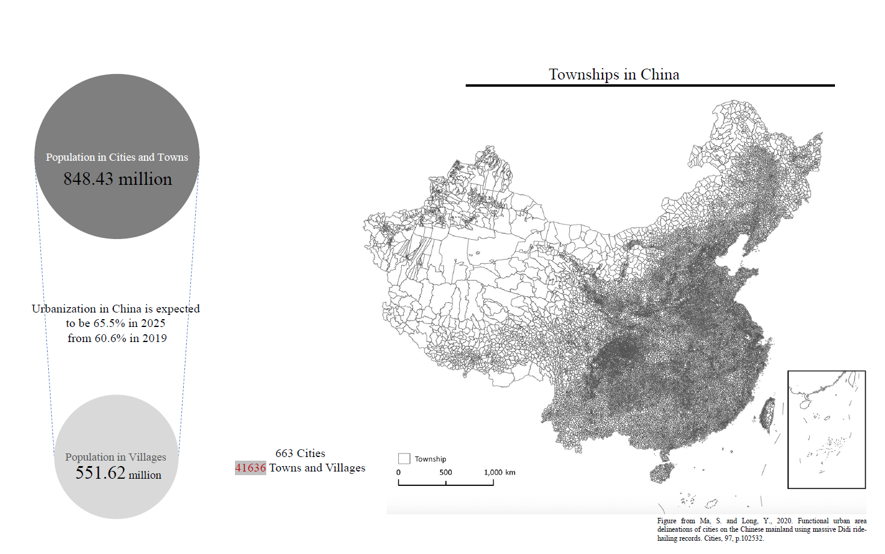

--A possible approach to quantify massive qualitative urban experience
<br/>
<br/>
<br/>
Supervisor: Carole Voulgaris
<br/>
<br/>
```{r setup, include=FALSE}
knitr::opts_chunk$set(echo = TRUE)
```

# Abstract

Understanding and reflecting urban dwellers' happiness, and perception of urban space and life in urban planning has long been a challenge in China. The Chinese government has progressively brought attention to public participation and views, which had previously been ignored. However, government approaches for fostering public engagement remain scarce, while enthusiasm among individuals to express feelings and comments on government planning is lacking. In this context, my research project proposes measuring individual citizens' emotions and characteristics of the built environment,the proximity to various urban amenities, to explore the relationships between citizens' sentiments, urban space, and urban activities. This approach can be applied to gather public feelings in the urban planning process through platforms, as a way to quantify the quality of urban life. By establishing a quantitative urban model, the happiness of urban residents(the sentiment of social media post) can become an indicator and standard as a way of bottom-up public participation, guiding planners' decisions to design a healthy, sustainable and people-centered city. 

<!-- Your portfolio should demonstrate each of the following skills (not all of which are demonstrated in this example): -->

<!-- * Displaying multiple vector layers on the same map -->
<!-- * Calculating and displaying relationships among point and polygon layers based on distance -->
<!-- * Aggregating point data to a layer of polygons -->
<!-- * Calculating and displaying accessibility, based on travel time -->
<!-- * Converting between raster layers and vector layers -->
<!-- * Displaying raster data on a map -->
<!-- * Georeferencing a raster image -->
<!-- * Displaying data on an interactive map -->

# Introduction
In China, the early stage of urbanization was subject to the national ambition and development, whose aim at boosting the economic production and consumption. As such, hundreds and thousands of cities and towns were built to serve for this purpose that plays an important role in improving the national economy based on the scarification of natural resource and incline of factory production. However, since the decreasing demand for industrial production and the arise of urban awareness of residents happiness, Chinese government increasingly focus on citizen wellbeing, urban governance and the urban environment. 

The new urban policies in China shifted the emphasis of urbanization away from economic development and toward human-centric development, improving residents' wellbeing and building new ecological smart cities. However, the evaluation of residents' wellbeing and urban planning process remains top-down and entirely conducted by governments and experts. The qualitative surveys and reports could only cover a small proportion of population, and it becomes even harder and time-consuming as the population in cities and towns reached 848 millions. 

With the introduction of social media data and machine learning technologies, new methods for studying urban spatial patterns and residents' life have emerged. In 2017, there were more than 753 million people have access to mobile internet, while 68% of them frequently use social media platform. The AI-based technology such as sentiment analysis could be used to extract individual feelings from text-based information, as a form of public perception of urban space, contributing to bottom-up engagement and people-oriented urban planning.

[](https://WTHSYZW.github.io/Thesis_2022/maps/township.png){target="_blank"}

# Literature Review

## Wellbeing as a Measure of Health and the Built environment

Scientists have historically measured well-being using objective indicators (e.g., GDP, health, employment, literacy, poverty) and increasing measured subjective well-being that influences individual life. Modern measures of well-being that account for cognitive evaluations (i.e., evaluative well-being) and reactions to experiences (i.e., experienced well-being) have therefore become the “currency of a life that matters” (Rath et al., 2010). As the concept of well-being develops, the indices including physical health, mental health, air quality and more are increasingly used, implying a strong relationship between health and residents’ well-being (Diener et al., 1999; Lawless & Lucas, 2010). Some studies found that population density may affect well-being on the city level (Florida et al., 2013). Mouratidis (2018) argues that compact urban form with better public transport, accessibility, the mix of land uses, and density positively influences neighborhood well-being. Social and human capital, considered significant drivers of urban well-being, can be affected by safety, educational opportunities, and access to arts and culture (Leyden et al., 2011; Florida et al., 2013). Other aspects of urban infrastructure (such as roads and transportation) impact commute time and connectedness, both of which are related to happiness (Yin et al., 2021; Gim, 2021).

## Big data, Social media and Sentiment analysis 

Recently, the availability of mobile information, big urban data and machine learning technology has significantly enhanced urban research methods, particularly in terms of the dynamic spatial and temporal relationships between human behaviour and urban research (Wu, Ye, Ren, & Du, 2018). The invitation of various big data could change China's top-down urban planning process by bringing individual information into the discussion of urban space and quality. With the rise of social media and machine learning, sentiment analysis became a field of study that mines public opinions, measures subjective happiness and relates them to different research areas. The previous studies applied Twitter, Sina Weibo data (Chinese Twitter) and Dazhong dianping (Chinese Yelp) to examine the relationship between urban form, spatial quality, and public comments, such as the relationship between quality of urban parks and travellers' behaviour and words; urban transportation and commercial facilities (Li et al., 2018; Ta et al., 2020; Yao et al., 2019; Plunz et al., 2019). Some research further studied the difference and distribution of residents' emotions regarding gender, time-dimension and different urban facilities (Ma et al., 2020; Zhen et al., 2018). 

## Quantitative urban measure of the built environment

The measurement of the built environment is constructed by a variety body of indices to address different urban issues. Cervero and Kockelman's developed initial "three Ds" (density, design, and diversity) in 1997 to evaluate the existing urban built environment. Edwing et al. expanded on this concept by adding two Ds (destination accessibility and transportation distance) (Ewing & Cervero, 2001; Ewing et al., 2009). More Ds were added afterwards to reflect the changing built environment, such as Demand management and Demographics (Ewing & Cervero, 2010). Scholars have modified the list of variables based on these quantitative frameworks to comprehensively examine the built environment while addressing various urban issues and topics. Some research used relative entropy to discern compactness from sprawl in the built environment (Tsai, 2005). Others used a multi-metric urban intensity index at a metropolitan scale, which included land use, infrastructure, and landscape variables in addition to density and compactness (Tate et al., 2005). More recent studies, especially in the Chinese context, Rowe et al. (2014) proposed the measurement of urban intensity from variables of compactness, density, diversity, and connectivity, aiming at revealing the resource distribution, transportation efficiency, and social integration in both cities and optimize the urban performance (Rowe et al., 2014). Later, Guan and Rowe (2016) evaluated the spatial structure of small towns in Zhejiang Province using similar urban intensity characteristics, such as density, compactness, diversity, and accessibility. 

# Research proposal

The research aims to apply sentiment analysis to quantify qualitative public feelings from text-based information as a representation of individual real-time happiness, and develop a multivariate model to explore the relationship between the individual feelings from social media and the built environment in China. Based on the model, this research compare existing condition and the planned condition of Jiaxing city in China, and test different planning scenarios to explore the possible changes of individual feeling when using social media platform. 

[](https://WTHSYZW.github.io/Thesis_2022/maps/workflow.pdf){target="_blank"}

# Methodology
Here are two maps of San Luis Obispo, California. I might include some text here as well.

## Interactive Map
This interactive map demonstrates the following skills: 

* Displaying data on an interactive map

<!-- [](https://c-voulgaris.github.io/portfolio_examples/fullsize/inter_black.html){target="_blank"} -->

## Clockboard Map
This map demonstrates the following skills:

* Aggregating point data to a layer of polygons

<!-- [](https://c-voulgaris.github.io/portfolio_examples/fullsize/clockboard.pdf){target="_blank"} -->

# Results
Here are two maps of San Luis Obispo, California. I might include some text here as well.

## Isochrones
This map shows isochrones based on transit travel times to the nearest school. It demonstrates the following skills:

* Displaying multiple vector layers on the same map
* Calculating and displaying accessibility, based on travel time

<!-- [](https://c-voulgaris.github.io/portfolio_examples/fullsize/SLO_schools.pdf){target="_blank"} -->

## Accessibility
This map shows accessibility based on a distance-decay function of the walking time to the nearest transit stop. It demonstrates the following skills:

* Displaying multiple vector layers on the same map
* Calculating and displaying accessibility, based on travel time
* Displaying raster data on a map

<!-- [](https://c-voulgaris.github.io/portfolio_examples/fullsize/SLO_transit.pdf){target="_blank"} -->

# Discussion/Scenarios
Here are two maps of San Luis Obispo, California. I might include some text here as well.

## Isochrones
This map shows isochrones based on transit travel times to the nearest school. It demonstrates the following skills:

# Contribution

# Limitation
